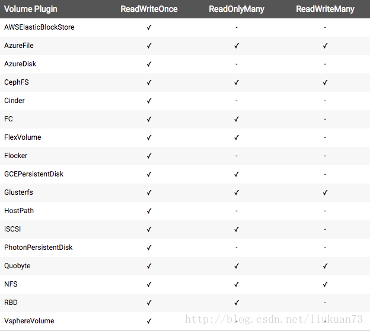
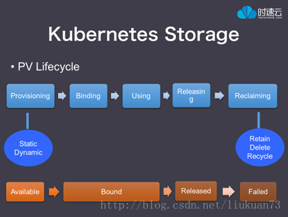
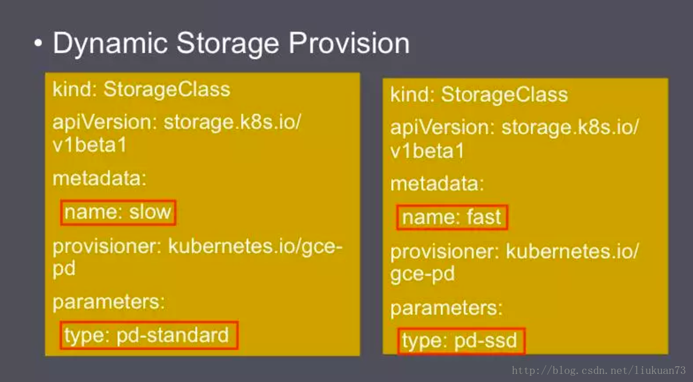

# PV PVC storageclass

### k8s存储PV分为静态，动态。
* 静态：需要先手动建立PV，然后建立PVC，系统自动用PVC与PV进行匹配绑定
* 动态：storageclass，不需要提前预先建立PV，在建立PVC的时候，会动态创建PV

### PV访问模式
*    ReadWriteOnce：是最基本的方式，可读可写，但只支持被单个Pod挂载。
*    ReadOnlyMany：可以以只读的方式被多个Pod挂载。
*    ReadWriteMany：这种存储可以以读写的方式被多个Pod共享。
> NOTE: 不是每一种存储都支持这三种方式，像共享方式，目前支持的还比较少，比较常用的是NFS。在PVC绑定PV时通常根据两个条件来绑定，一个是存储的大小，另一个就是访问模式。




### 回收策略

现有回收策略有：

*    Retain – 手动重新使用
*    Recycle – 基本的删除操作 (“rm -rf /thevolume/*”)
*    Delete – 关联的后端存储卷一起删除，后端存储例如AWS EBS, GCE PD或OpenStack Cinder

目前只有NFS和HostPath支持回收，AWS EBS, GCE PD和Cinder volumes只支持删除。
卷的状态

### 卷有4种状态，一个卷必属于其中之一:

*   Available –闲置状态，没有被绑定到PVC
*   Bound – 绑定到PVC
*   Released – PVC被删掉，资源没有被在利用
*   Failed – 自动回收失败



### 整个生命周期是
1. Provisioning: 创建PV
2. Binding: 绑定PVC
3. 被Pod使用
4. Pod使用完毕，Pod被销毁，释放PV
5. 根据策略处理这个PV
* Retain 保留这个PV，今后必须手动删除
* Delete 删除这个PV和所有数据
* Recycle 保留这个PV，但是删除上面的数据，使这个PV可以被重复利用
> 目前，只有NFS和HostPath支持回收。 AWS EBS，GCE PD，Azure Disk和Cinder卷支持删除


### PVC中利用注解来选定StorageClass
> 用户在 PersistentVolumeClaim 中可以包含一个 StorageClass 申请动态提供存储。这一任务需要使用 **volume.beta.kubernetes.io/storage-class** 注解来完成。这一注解的值必须符合管理员配置的 StorageClass 名称。



##### provisioner是存储的提供商
##### parameters是提供商提供的一些参数，每个provisioner提供的不一样
##### 这里用的是GCE


### 设置default的storageClass
> 所有的 PVC 都可以在不使用 StorageClass 注解的情况下，直接使用某个动态存储。把一个StorageClass 对象标记为 “default” 就可以了。StorageClass 用注解**storageclass.beta.kubernetes.io/is-default-class** 就可以成为缺省存储。

### 手动建立PV－－静态PV
```
  apiVersion: v1
  kind: PersistentVolume
  metadata:
    name: pv0001
    namespace: default
  spec:
    capacity:
      storage: 5Gi
    accessModes:
      - ReadWriteOnce
    persistentVolumeReclaimPolicy: Recycle
    storageClassName: slow
    nfs:
      path: /tmp
      server: 172.17.0.2
```

### 动态PV－－StorageClass
```
kind: StorageClass
apiVersion: storage.k8s.io/v1
metadata:
  name: standard
provisioner: kubernetes.io/aws-ebs
parameters:
  type: gp2
```

### PVC－－绑定PV
```
kind: PersistentVolumeClaim
apiVersion: v1
metadata:
  name: myclaim
spec:
  accessModes:
    - ReadWriteOnce
  resources:
    requests:
      storage: 8Gi
  storageClassName: standard
  selector:
    matchLabels:
      release: "stable"
    matchExpressions:
      - {key: environment, operator: In, values: [dev]}
```

### Pod－－使用PVC
```
kind: Pod
apiVersion: v1
metadata:
  name: mypod
spec:
  containers:
    - name: myfrontend
      image: dockerfile/nginx
      volumeMounts:
      - mountPath: "/var/www/html"
        name: mypd
  volumes:
    - name: mypd
      persistentVolumeClaim:
        claimName: myclaim
```
> NOTE: pod必须与PVC在同一个**namespace**