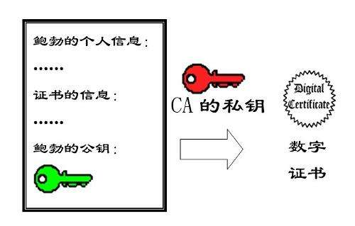

# openssl

## 数字签名

将报文使用一定的HASH算法算出一个固定位数的摘要信息，然后用私钥将摘要加密，连同原来的报文一起，发送给接收者，接受者通过公钥将摘要解出来，也通过HASH算法算出报文摘要，如果两个摘要一致，说明数据未被篡改，数据是完整的。
因为接收者是使用公钥解出的数据，如果数据完整，证明发送数据的人持有私钥，就能证明发送者的身份，因此数字签名具有证明发送者身份和防篡改的功能。

#### 数字签名 = 私钥加密 公钥解密

## 数字证书

由CA颁发给网站的身份证书，里面包含了该网站的公钥，有效时间，网站的地址，CA的数字签名等。

所谓的CA数字签名，实际上就是使用了CA的私钥将网站的公钥等信息进行了签名，当客户端请求服务器的时候，网站会把证书发给客户端，客户端首先可以通过CA的数字签名校验CA的身份，也能证明证书的真实完整性（之前说了，数字签名拥有证明身份和防篡改的功能）。

####  数字证书 = 把公钥传给CA， 然后用CA的私钥加密

1. https请求
2. 得到server的数字证书（用CA私钥加密的server公钥）
3. 用CA的公钥解密数字证书，判断是否是合法的server公钥

